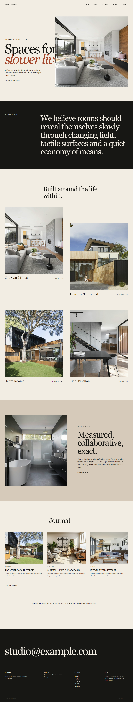

# Stillform — WordPress architecture studio

A native WordPress theme with a working Docker demo, five main pages, four fictional project detail pages and three journal articles. The v1.0.0 static preview is superseded by v1.1.0.

## Download and install

Use `stillform-1.1.0.zip`. Upload it through Appearance → Themes, activate, then open Appearance → Stillform demo and explicitly install the bundled demo. Set a real email in Appearance → Customize → Stillform contact before public launch. No contact form is simulated. Demo content and project names are fictional; photographs do not represent the site owner's work.

Full theme instructions and asset license notes: [theme README](stillform/README.md).

## Run locally with Docker

Requires Docker Desktop with Linux containers and Docker Compose.

1. Copy `.env.example` to `.env` and choose three independent local passwords. Never commit `.env`.
2. Run `docker compose up -d --wait`.
3. Install WordPress at `http://127.0.0.1:8097` using its browser setup wizard.
4. Activate Stillform and use Appearance → Stillform demo.
5. Set a post-name permalink structure in Settings → Permalinks.

Only the web port is exposed, bound to localhost. Database and WordPress data use isolated named volumes. Do not use `down -v` unless you explicitly intend to erase this local site's database and uploads.

## Verified release

The release ZIP was extracted and exercised in a separate fresh Docker WordPress database at `http://127.0.0.1:8098`. This is the verified local review site on the build machine, not a public hosting URL.

- WordPress 7.1.0 / PHP 8.3 / MySQL 8.4.
- 5 demo pages, 4 projects, 3 journal posts and 8 imported photographs.
- Installer repeated without duplicate content; conflicting non-owned content preserved.
- Theme activation did not create content.
- Native page content changes and contact setting changes rendered on frontend, then test changes were restored.
- All five pages captured from the real Docker site at 1440px and 390px.
- 12 internal navigation/content URLs returned HTTP 200.
- Images loaded on all ten main-page captures; no horizontal overflow.
- Mobile menu opens and Escape closes it; additional 360px check passed.
- 8 structural regression tests passed; theme PHP and JavaScript syntax checks passed.

Machine-readable evidence: `runtime-evidence.json`, `browser-evidence.json`, `link-evidence.json`, `interaction-evidence.json`. Screenshots are in `screenshots/`, not from a separate HTML mock.

Limitations: focused Chromium checks, not an exhaustive cross-browser/accessibility audit. Core PHP warnings/deprecations occurred during WP-CLI setup; no fatal error was observed. Contact uses a clearly marked configurable example address until replaced. No email delivery service or form plugin is bundled. The recurring publishing schedule remains paused pending user review.
